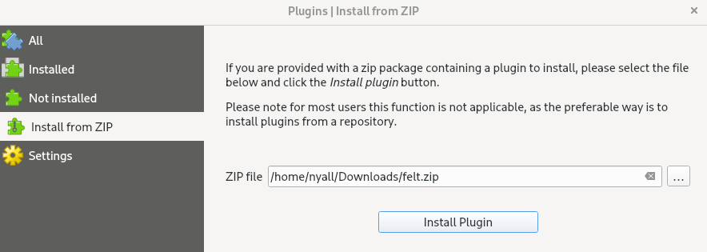
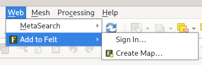
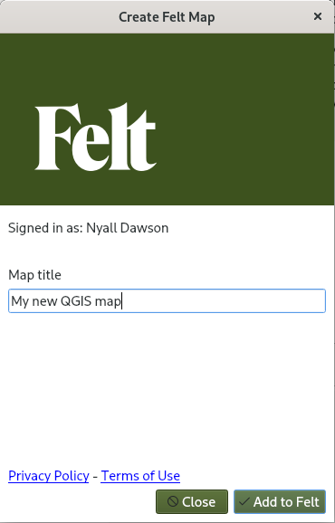

## Testing the Felt plugin beta

First, download the release zip file from https://github.com/felt/qgis-plugin/releases/download/0.0.6/felt.zip
and save the file locally.

From within QGIS:

- Select `Plugins` - `Manage and Install Plugins`
- Click on the `Install from ZIP` tab
- Click the `...` button and select the downloaded `felt.zip` file
- Press `Install Plugin`, and accept the security warning

The Felt plugin pre-release will then be installed onto QGIS. Close the Plugin
Manager dialog.

You should then see a new entry in the QGIS `Web` menu, for `Add to Felt`:

Selecting `Sign In` will trigger the client authorization via the Felt homepage.
After successful authorization, selecting `Create Map` will trigger an upload
of the current QGIS map to Felt:

Maps can also be shared to Felt from:

- The Web toolbar `Share Map to Felt` button
- The `Project` - `Import/Export` - `Share Map to Felt` action
- Right clicking a layer and selecting `Share Layer to Felt` from the `Export` menu